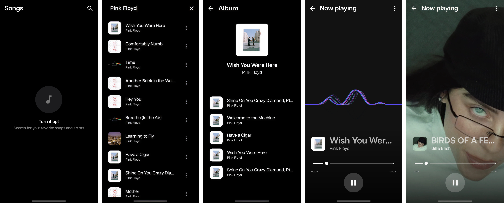

# Moises - Challenge 🎵

A modern Android application built with Jetpack Compose, showcasing a multi-module architecture and clean song playback experience.

## ✨ Features

- **🔍 Smart Search**: Effortlessly search for your favorite songs and artists.
- **📄 Pagination**: Seamlessly navigate through large search results with efficient data loading (Paging 3).
- **💿 Album Details**: Explore full albums with detailed track listings and artwork.
- **🎧 Seamless Playback**: High-quality audio streaming using Media3 ExoPlayer.
- **🕙 History**: Automatically tracks recently played songs as soon as you start listening.
- **🚧 Robust Design**: Centralized error handling and modern UI components powered by a custom design system.

## 🛠️ Tech Stack

- **UI**: Jetpack Compose (Modern, declarative UI).
- **Architecture**: Multi-module Clean Architecture (Split into `:feature`, `:common`, and `:core`).
- **Dependency Injection**: Hilt (Standard for Android dependency management).
- **Asynchrony**: Kotlin Coroutines & Flow (Reactive state management).
- **Pagination**: Jetpack Paging 3 (Efficient list loading and state management).
- **Media**: Media3 ExoPlayer (Advanced audio playback features).
- **CI/CD**: GitHub Actions (Automated unit testing and build artifact generation).

## 📁 Repository Structure

- **`:feature`**: UI-focused modules for specific app features (Songs, Album, Song Details).
- **`:common`**: Reusable logic and domain entities shared across features (Player, Songs persistence, Navigation).
- **`:core`**: Low-level infrastructure modules (Network, Preferences).
- **`:design`**: Centralized design system with curated components and styling tokens.

## 🎨 Layout Deviations

While the application stays true to the core design goals, I've made several intentional technical and UX decisions that deviate from the static mockups:

### 1. Splash Screen
Adopted the **latest native Android Splash Screen API** instead of a custom gradient layout. This provides the most consistent and recommended launch experience across different Android versions and device manufacturers.

### 2. Player Screen
- **Dynamic UX**: Instead of using a static low-resolution (100x100) album image as a background, which would result in poor visual quality, I implemented a **dynamic wave animation** for audio-only tracks. This keeps the interface feeling alive and premium.
- **Maintainable Components**: Reused the `SongListItem` component for the song title section to ensure design consistency and long-term maintainability.

### 3. Extra Functionality
Implemented the ability to **remove items from the Recently Played list**. While not in the original design, this provides users with better privacy and control over their playback history.

### 4. Robust Error States
Designed and implemented comprehensive **error states** (Internet, Server, Not Found). These were crafted from scratch to ensure the app remains user-friendly and informative during edge cases not explicitly covered in Figma.

## 🚀 Getting Started

1. Clone the repository.
2. Open with **Android Studio Ladybug** (or later).
3. Build and run on a physical device or emulator.
4. Run unit tests using `./gradlew testDebugUnitTest`.
